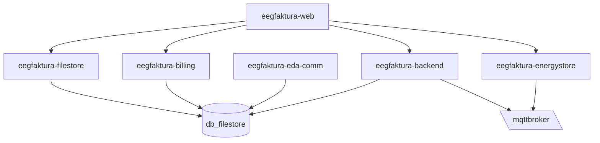

# eegfaktura
Public repository providing all information required to run your own `eegfaktura` instance.

`eegfaktura` is an open source project initiated by [Verein zur Förderung von Erneuerbaren Energiegemeinschaften ](https://vfeeg.org) to provide a free management and invoicing system for Energiegemeinschaften (EEG; lit. "energy community")

